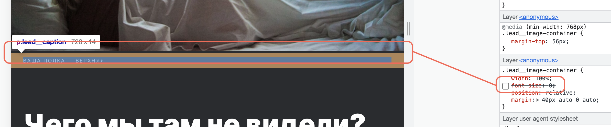
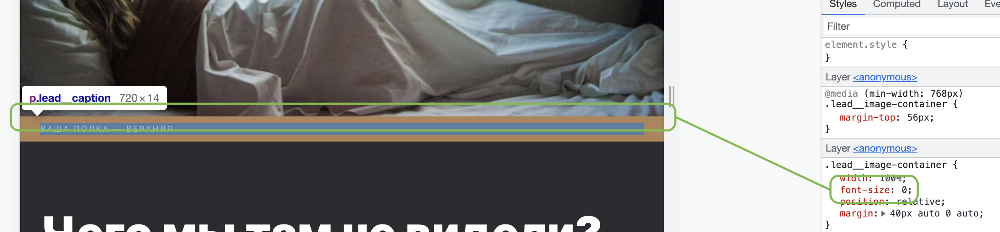
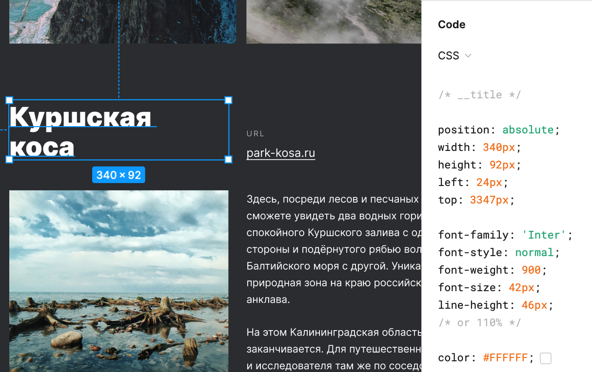
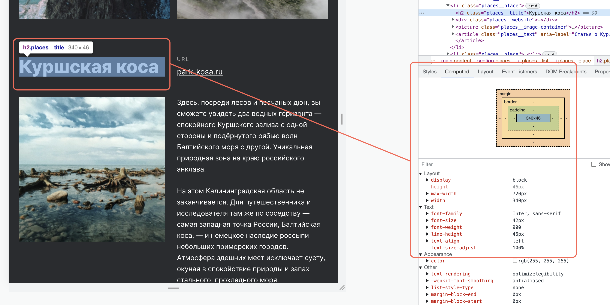

<h1 align="center">Russian Travel</h1>
<h2 align="center">&copy; Dima Klimkin</h2>
<p align="center"> <a href="https://github.com/kobewinona" target="_blank" rel="noreferrer">  </a> <a href="https://kobewinona.github.io/russian-travel/" target="_blank" rel="noreferrer">  </a> </p>

<h3 align="center">languages and tools used in this project</h3>
<p align="center"> <a href="https://www.w3schools.com/css/" target="_blank" rel="noreferrer">  </a> <a href="https://www.w3.org/html/" target="_blank" rel="noreferrer">  </a> <a href="https://code.visualstudio.com/" target="_blank" rel="noreferrer">  </a> <a href="https://git-scm.com/" target="_blank" rel="noreferrer">  </a> <a href="https://en.bem.info/" target="_blank" rel="noreferrer">  </a> </p>

<br>
<br>

- ► [about this project](#about)
- ► [CSS syntax decoration I used in this project](#syntax)
- ► [styling of this project](#styling)
- ► [difficulties during this project](#difficulties)
- ► [mobile-first vs desktop-first](#first)

<br>
<br>

----

<h3 align="center"> <a name="about"> about this project </a> </h3>

----

This project helped me to understand adaptive, flexible and responsive design. I've learnt a lot from building this small page.

The webpage itself is about travelling in Russia and its beauties.

<br>

----

<h3 align="center"> <a name="syntax"> CSS syntax decoration I used in this project </a> </h3>

----

To make the code more readable for me I decided to devide rules by their function:

```css
.header__title {
  width: 730px;

  font-size: 102px;
  font-weight: 600;
  line-height: 96px;

  position: relative;
  margin: 0 0 0 64px;

  z-index: 2;
}
```

<br>

**1st** block of lines describes an object in generall:

```css
dev {
  width: 0;
  min-height: 0;
  box-sizing: border-box;
  overflow: hidden;
}
```
>etc.

<br>

**2nd** block of lines describes text and its decoration:

```css
dev {
  color: #fff;
  font-size: 14px;
  font-weight: normal;
  text-align: center;
}
```
>etc.

<br>

**3rd** block of lines describes an object's content layout:

```css
dev {
  display: flex;
  flex-flow: row wrap;
  justify-content: space-between;
  column-gap: 0;
}
```
>etc.

<br>

**4th** block of lines describes an object's position and size:

- *rules' order goes from the furthest* ❏ *to the closest* ■ *to content*

- *rules with sides*  *go from top to the left* ↻

```css
dev {
  position: absolute;
  top: 0;
  right: 0;
  margin: 0;
  border: none;
  padding: 0;
}
```


<br>

**5th** block of lines is just ```z-index``` ☺.

<br>

Inside those made-up blocks of lines I also try to maintain a certain order but sometimes I fail and it's not like anyone will ever see this anyway)

<br>

----

<h3 align="center"> <a name="styling"> styling of this project </a> </h3>

----

<h6 align="center"> This is here just so I could add those cool bubbles with colors. </h6>

<br>

**font**

```css
font-family: 'Inter', sans-serif;
```

**colors**

<p> <span style="color: #2a2c2f"> ⬤ </span> dark grey (background) #2a2c2f</p>

<p> <span style="color: #fff"> ⬤ </span> black (text) #fff</p>

<br>

----

<h3 align="center"> <a name="difficulties"> difficulties during this project </a> </h3>

----

<br>

**1 problem**

Tag ```<picture>``` creates a small margin based on font-size:


*margins beetwen an element in ```<picture>``` and ```<p>``` without specifying ```font-size```*

<br>


*margins beetwen an element in ```<picture>``` and ```<p>``` with specifying ```font-size```*

<br>

**solution**

>specifying ```font-size``` to 0 helps:
```css
.lead__image-container {
  width: 100%;
  font-size: 0;

  position: relative;

  margin: 40px auto 0 auto;
}
```

<br>

---

<br>

**2 problem**

For some reason text in a browser doesn't wrap the way it does in a design template, even though all the parametres are specified in a markup.


*the second word is taking another line to fit the box it is in.*

<br>


*the second word stays in one line with the first word.*

The problem persists in **Chrome**, **FireFox** and **Safari**.

<br>

**no solution ☹**

<br>

----

<h3 align="center"> <a name="first"> mobile-first vs desktop-first </a> </h3>

----

<br>

I started building the website **desktop-first** but soon figured out that the code becomes so messy with media queris.
1. The fact that you need to add 1 to a resolution you make a query for is confusing. Doing this kind of math when browsing through the code is too tiresome (*but then again I might do something wrong* ☺).
2. The fact that width declared in a query does not help you to identify for what screen this query is for is so confusing.

<br>

```css
@media (max-width: 767px) {

}
```

>first you need to make an addition of 1 and 767 to get that this break-point is for screens of 768px and higher.

>second this query is not for tablets as the number of pixels may suggest but for mobile screens.

<br>

In addition to the mess above I sometimes had to use ```(min-width: 1280px)``` to set up a markup for wider screens, so chosing desktop-first you start a website kind of in-between resolutions and you just have to write more code to make it clear for a browser.

<br>

So I quickly switched to **mobile-first** and the code is so much cleaner.

```css
@media (min-width: 320px) {

}
```

>This is for mobile screens from 320px as the name clearly suggests.

```css
@media (min-width: 768px) {

}
```

>This is for tablet screens from 768px as the name clearly suggests.

```css
@media (min-width: 1024px) {

}
```

>This is for desktop screens from 1024px to infinity of beautiful pixels.

<br>
<br>

----

<p align="center">thanks to yandex practicum team</p>
<p align="center"> <a href="https://practicum.yandex.ru/" target="_blank" rel="noreferrer">  </a> </p>
<p align="center">♥</p>
